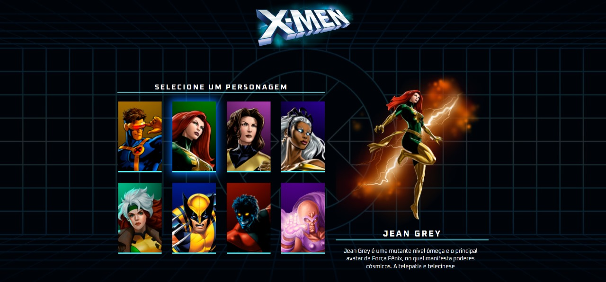

<h1 align="center">
    Projeto X-men
</h1>

## 🛠 Tecnologias

As seguintes ferramentas foram usadas na construção do projeto:
- **[HTML](https://html.com/)**
    
-   **[CSS](https://www.w3.org/Style/CSS/Overview.en.html)**
      